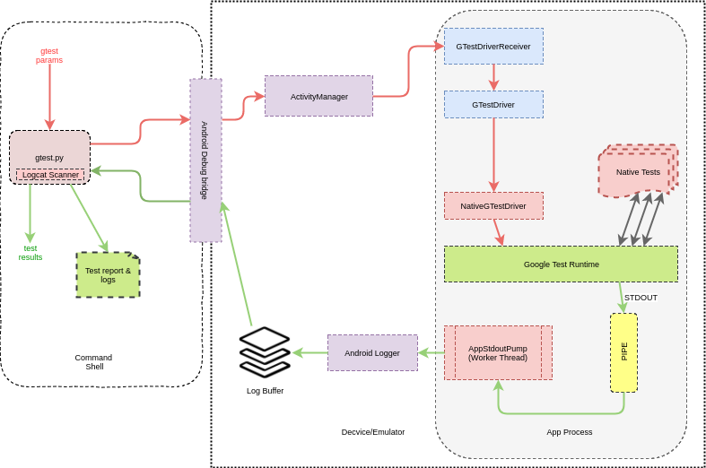

# android-gtest-driver
Google Test for NDK based Android Apps

## Introduction

This repo contains a sample Android project with C++ (NDK) support. In
this project the Google Test framework
(https://github.com/google/googletest) is integrated for
Instrument/Unit testing of its native components. The primary aim of
this repo is to show how we can integrate Google Test to manage and
run native (C++) Unit/Instrumented tests on real devices or emulators,
while providing the flexibility of using the same great command line
interface to gtest on the dev machine.

## Rationale

The Unit testing of shared native modules typically requires a large
overhead of extracting the modules out so it could run under tests on
the development machines. This usually requires rebuilding the
binaries for the target dev machine with mocking and simulating things
around it. In practice, real systems are complex with myriad
inter-dependencies. Testing a component by mocking its actual
dependencies and, that too, outside of its actual run-time context is
a complex, costly and tedious task. It is also hard to guarantee that
the module under test will behave in exactly the same way in both
test(dev box) and production environment. Also, it becomes
increasingly hard to maintain the pure unit testing with mock
everything strategy in presence of pressing deadlines and influx of
new features. Often the ball gets dropped in the middle of the project
and thereafter abandoned - as the cost (engineering debt) to revive it
then gets prohibitively expensive.

While pure Unit testing provides its value; instrumented tests which
run on the actual device/emulator provides a sweet spot which gets us
higher ROI and more confidence in quality (as entities get tested
under real conditions). The downsides of it could be slowness and
flakiness of the test runs. But those concerns can be mitigated by
avoiding delay causing steps like UI interactions and by providing
controlled network conditions (say by testing against services
available in the local network).

## Problem

Though there would be benefits of intrumented way testing native C++
components, but sadly the tooling support for it, as of now, is
absent. A dev may choose to hand-craft instrumentation tests but that
effort won't scale in comparision to using an industry standard
testing framework.

Google Test is the leading xUnit based C++ testing framework from
Google. It is used for testing high profile and large scale projects
like Chormium, LLVM, Protocol Buffer, NDK etc. Though it is
light-weight, robust and having good eco-system/community - but it
lacks support when it comes to its integration in Android
projects. Android Studio does not provide any tooling support for it
either - though it has an excellent support for managing tests at the
Java side.

android-gtest-driver tries to fill that gap.

## Idea

Google Test interaction for system under test happens via the command
line parameters and the standard input/output channels (STDOUT to be
precise). The idea is to introduce a proxy program which mimics the
command line and STDOUT behavior for the gtest interactions happening
in the App on the device or emulator. The driver program behaves as if
it is the system under test, but the actual gtest initialization and
the test runs happen on the device/emulator. This proxy way of
interaction is achieved using ADB channel and by redirection of STDOUT
of the App process to android log. The driver program additionally
keeps track of test results and adb logs of each run (in the
time-stamped named files).

### Input to Google Test Run

Test driver's takes the gtest command line params -> a broadcast
intent with those parameters as intent extra is sent via ADB ->
broadcast received at the app's gtest specific broadcast receiver ->
the parameters are extracted from the intent -> invoke native Google
test run (a JNI call) by initializing gtest for the supplied
parameters.

### Output from Google Test Run

Tests generates results on STDOUT -> STDOUT is funnelled via a PIPE ->
Input stream of the PIPE is put into Android logs (by a worker thread)
-> ADB gets the logs to the driver program -> the driver monitors the
start and the end of Google Test specific logs -> the driver puts the
results back into its own STDOUT channel.

## Design

